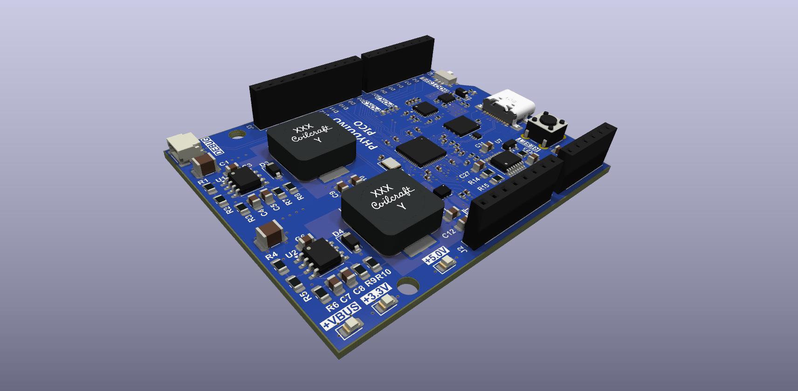

# Phyduino Pico

## Description

This repository has all CAD files for the Phyduino Pico board used in the University of Toronto, Department of Physic, "[Introduction to Electronics course.](https://plrs.physics.utoronto.ca/course-listing/)" 

This board is used to train graduate students first and foremost in surface mount hole solder techniques. As part of the training in the course they will as learn digital interfaces and digital IO design methods as well. This board is a fully function Arduino Uno style board using the Raspberry PI RP2040 microcontroller.

The CAD program used to design this board is [KiCAD](https://www.kicad.org/) which open source and free to use. The [Interactive Html BoM](https://github.com/openscopeproject/InteractiveHtmlBom) plugin was used to generate the interactive bill of materials html file.

## Files

- Gerber Files are located in the [fabrication folder](./fab)
- There is an [Interactive bill of materials html file](https://perc-sw.github.io/phyduino_pico/bom/ibom_student.html) that you can use to assist you in assembling the board. 
- PDF of [Schematic](./docs/pdf/board/phyduino_pico_schematic.pdf)
- PDF of PCB
    - [Top Layer](./docs/pdf/board/phyduino_pico_pcb_front.pdf)
    - [Inner Layer 1](./docs/pdf/board/phyduino_pico_pcb_inner1.pdf)
    - [Inner Layer 2](./docs/pdf/board/phyduino_pico_pcb_inner2.pdf)
    - [Bottom Layer](./docs/pdf/board/phyduino_pico_pcb_back.pdf)